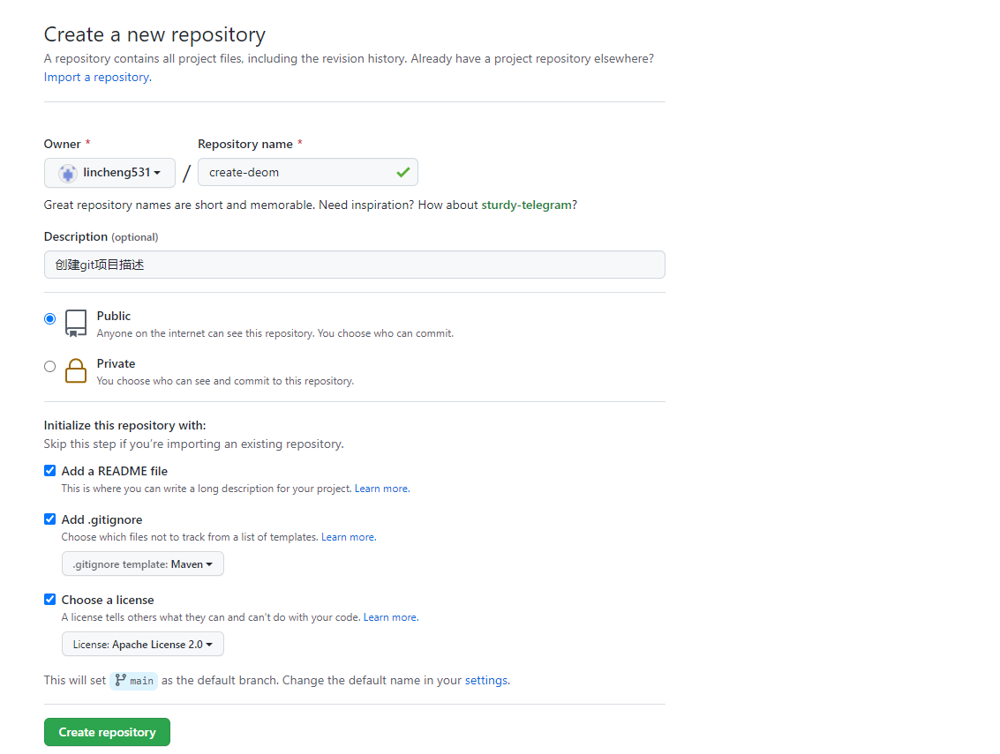

# study

### 一、项目创建



1. 输入名称
2. 添加描述
3. 项目权限（公开或私有）
4. Add a README file 打钩(会生成README.md文件)
5. add .gitignore 打钩并且选择Maven(作用：git过滤不需要提交的文件)
6. Choose a license 打钩并且选择Apache License 2.0 (作用：开源协议说明)

### 二、linux

#### 2.1 安装docker

[安装官方文档](https://docs.docker.com/engine/install/centos/) 

1. 卸载旧版本

   ```
   sudo yum remove docker \
                     docker-client \
                     docker-client-latest \
                     docker-common \
                     docker-latest \
                     docker-latest-logrotate \
                     docker-logrotate \
                     docker-engine
   ```

2. 安装所需工具与安装地址

   ```
    sudo yum install -y yum-utils 
    
    sudo yum-config-manager \
       --add-repo \
       https://download.docker.com/linux/centos/docker-ce.repo
   ```

3. 安装*最新版本*的 Docker Engine 和 containerd

   ```
   sudo yum install docker-ce docker-ce-cli containerd.io
   ```

4. 启动 Docker

   ```
   systemctl start docker
   ```

5. 设置开机自动启动

   ```
   systemctl enable docker
   ```

6. 重启docker服务

   ```
   systemctl restart docker
   ```
   
7. 查看docker的运行状态

   ```
   systemctl status docker
   ```

#### 2.2 配置阿里云镜像加速

[阿里云官方文档](https://cr.console.aliyun.com/cn-hangzhou/instances/mirrors) 

```
sudo mkdir -p /etc/docker
sudo tee /etc/docker/daemon.json <<-'EOF'
{
  "registry-mirrors": ["https://8z6fkgsn.mirror.aliyuncs.com"]
}
EOF
sudo systemctl daemon-reload
sudo systemctl restart docker
```

#### 2.3 docker 命令

1. 查看正在运行的容器

   ```
   docker ps
   ```

2. 查看所有的容器(包括run、stop、exited状态的)

   ```
   docker ps -a
   ```

3. 只能删除没有在运行的容器

   ```
   docker rm 容器ID
   ```

4. 可以删除正在运行的容器

   ```
   docker rm -f 容器ID
   ```

5. 查看安装版本

   ```
   docker -v 
   ```

6. 查看docker已安装的镜像

   ```
   docker images
   ```

7. 拉取对应版本的镜像

   ```
   docker pull 镜像名称:版本号
   ```

8. 默认拉取最新的镜像

   ```
   docker pull 镜像名称
   ```

9. 启动容器

   ```
   docker start 容器ID
   ```

10. 终止容器

    ```
    docker stop 容器ID
    ```

11. 重启容器

    ```
    docker restart 容器ID
    ```

12. 删除镜像

    ```
    docker rmi 镜像名称 or ID
    ```

13. 开机自动启动容器

    ```
    docker update mysql --restart=always
    docker update redis --restart=always
    ```

#### 2.4 安装jdk1.8

1. 拷贝到指定安装目录

   ```
   cp -r /root/tools/jdk-8u144-linux-x64.tar.gz /usr/local/java
   ```

2. 解压操作

   ```
   #切换到指定目录
   cd /usr/local/java
   #解压文件
   tar -zxvf jdk-8u144-linux-x64.tar.gz   
   ```

3. 配置环境变量

   ```
   # 编辑配置文件
   vim /etc/profile
   ```

   复制以下内容，加在文件末尾，更新环境变量，

   ```
   export JAVA_HOME=/usr/local/java/jdk1.8.0_144
   export JRE_HOME=/$JAVA_HOME/jre
   export CLASSPATH=.:$JAVA_HOME/jre/lib/rt.jar:$JAVA_HOME/lib/dt.jar:$JAVA_HOME/lib/tools.jar
   export PATH=$PATH:$JAVA_HOME/bin:$JRE_HOME/bin
   
   source /etc/profile
   ```

4. 检查是否安装成功

   ```
   # 测试版本号
   java -version
   
   # 返回
   java version "1.8.0_144"
   Java(TM) SE Runtime Environment (build 1.8.0_144-b01)
   Java HotSpot(TM) 64-Bit Server VM (build 25.144-b01, mixed mode)
   
   # 查询JAVA_HOME
   echo $JAVA_HOME
   
   # 返回
   /usr/local/java/jdk1.8.0_144
   ```

#### 2.5 docker安装mysql

1. 查看可用的 MySQL 版本

   访问 MySQL 镜像库地址：https://hub.docker.com/_/mysql?tab=tags 。

   可以通过 Sort by 查看其他版本的 MySQL，默认是最新版本 **mysql:latest** 。

2. 下载镜像

   ```
   docker pull mysql:8.0.18
   ```

3. 创建挂载目录

   ```
   mkdir -p /usr/local/mysql/conf
   mkdir -p /usr/local/mysql/data
   mkdir -p /usr/local/mysql/logs
   ```

4. 新建my.cnf配置文件

   ```
   vi /usr/local/mysql/conf/my.cnf
   ```

   复制以下内容，为了解决中文乱码问题

   ```
   [mysqld]
   pid-file        = /var/run/mysqld/mysqld.pid
   socket          = /var/run/mysqld/mysqld.sock
   datadir         = /var/lib/mysql
   secure-file-priv= NULL
   # Disabling symbolic-links is recommended to prevent assorted security risks
   symbolic-links=0
   character-set-server=utf8 
   [client]
   default-character-set=utf8 
   [mysql]
   default-character-set=utf8 
   # Custom config should go here
   !includedir /etc/mysql/conf.d/
   ```

5. 创建并启动容器

   ```
   docker run --restart=always -d -v /usr/local/mysql/conf/my.cnf:/etc/mysql/my.cnf -v /usr/local/mysql/logs:/logs -v /usr/local/mysql/data/mysql:/var/lib/mysql  -p 3306:3306 --name mysql -e MYSQL_ROOT_PASSWORD=123456 mysql:8.0.18
   ```

   参数解释

   ```
   --restart=always                                   -> 开机启动容器,容器异常自动重启
   -d                                                 -> 以守护进程的方式启动容器
   -v /usr/local/mysql/conf/my.cnf:/etc/mysql/my.cnf  -> 映射配置文件
   -v /usr/local/mysql/logs:/logs                     -> 映射日志
   -v /usr/local/mysql/data/mysql:/var/lib/mysql      -> 映射数据
   -p 3306:3306                                       -> 绑定宿主机端口
   --privileged=true			->容器内的root拥有真正root权限，否则容器内root只是外部普通用户权限
   --name mysql                                       -> 指定容器名称
   -e MYSQL_ROOT_PASSWORD=123456                      -> 写入配置root密码
   ```

6. 修改mysql

   ```
   #docker登录mysql
   docker exec -it mysql bash
   mysql -uroot -p 
   #查看mysql
   show databases;
   #使用mysql
   use mysql;
   #修改root用户加密规则
   alter user 'root'@'%' identified by 'root' password expire never;
   #修改root用户的加密规则
   alter user 'root'@'%' identified with mysql_native_password by'123456';
   #刷新权限
   flush privileges;
   #退出
   exit
   ```

7. 关闭防火墙或者开放端口

   ```
   #关闭防火墙
   systemctl stop firewalld.service
   ```


#### 2.6 docker安装redis

1. 下载镜像

   ```
   docker pull redis:6.0.16
   ```

2. 创建挂载目录

   ```
   mkdir -p /usr/local/redis/conf
   mkdir -p /usr/local/redis/data
   ```

3. 新建redis.conf配置文件

   ```
   touch /usr/local/conf/redis.conf
   ```

   复制以下内容，解决redis持久化

   ```
   appendonly yes
   ```

4. 创建并启动容器

   ```
   docker run -d \
   -v /usr/local/redis/data:/data \
   -v /usr/local/redis/conf/redis.conf:/etc/redis/redis.conf \
   -p 6379:6379 \
   --name redis \
   --restart=always \
   --privileged=true \
   redis:6.0.16 redis-server /etc/redis/redis.conf
   ```

   配置说明

   ```
   redis:6.0.16 redis-server /etc/redis/redis.conf    ->  指定配置文件启动redis-server进程
   ```

5. 开机自动启动容器

   ```
   docker update redis --restart=always
   ```

#### 2.7 docker安装nacos

[nacos-docker官方文档](https://github.com/nacos-group/nacos-docker/blob/master/README_ZH.md)

1. 下载镜像

   ```
   docker pull nacos/nacos-server:1.4.2
   ```

2. 创建挂载目录

   ```
   mkdir -p /usr/local/nacos/logs/                     
   ```

3. 创建并启动容器

   1. 持久化配置：

      创建nacos数据库并且执行建表语句:nacos-server-1.4.2\nacos\conf\nacos-mysql.sql

   2. 执行命令启动容器

   ```
   docker run -d \
   -e MODE=standalone \
   -e SPRING_DATASOURCE_PLATFORM=mysql \
   -e MYSQL_SERVICE_HOST=124.223.106.150 \
   -e MYSQL_SERVICE_PORT=3306 \
   -e MYSQL_SERVICE_USER='root' \
   -e MYSQL_SERVICE_PASSWORD='123456' \
   -e MYSQL_SERVICE_DB_NAME=nacos \
   -e TIME_ZONE='Asia/Shanghai' \
   -v /usr/local/nacos/logs:/home/nacos/logs \
   -p 8848:8848 \
   --name nacos \
   --restart=always \
   --privileged=true \
   nacos/nacos-server:1.4.2
   ```

4. 确保启动没有错误，可以查看日志

   ```
   cat /usr/local/nacos/logs/start.out
   ```

5. 配置容器自动启动

   ```
   docker update nacos --restart=always
   ```

#### 2.8 docker安装seata

1. 下载镜像

   ```
   docker pull seataio/seata-server:1.3.0
   ```

2. 创建挂载目录

   ```
   mkdir /usr/local/seata/conf/config-center/nacos
   mkdir /usr/local/seata/conf/logs
   ```

3. 在/usr/local/seata/conf创建配置文件

   - file.conf 

     ```
     touch /usr/local/seata/conf/file.conf
     ```

     复制以下内容，设置seata配置

     ```
     store {
       
       mode = "db"
     
       db {
         datasource = "druid"
         dbType = "mysql"
         driverClassName = "com.mysql.cj.jdbc.Driver"
         url = "jdbc:mysql://121.5.143.40:3306/seata"
         user = "root"
         password = "123456"
         minConn = 5
         maxConn = 30
         globalTable = "global_table"
         branchTable = "branch_table"
         lockTable = "lock_table"
         queryLimit = 100
         maxWait = 5000
       }
     
     }
     ```

   - registry.conf

     ```
     touch /usr/local/seata/conf/registry.conf
     ```

     复制以下内容，设置seata的服务注册，配置中心的配置

     ```
     registry {
      
       type = "nacos"
     
       nacos {
         application = "seata-server"
         serverAddr = "121.5.143.40:8848"
         group = "SEATA_GROUP"
         namespace = ""
         cluster = "default"
         username = "nacos"
         password = "nacos"
       }
      
     }
     
     config {
     
       type = "nacos"
     
       nacos {
         serverAddr = "121.5.143.40:8848"
         namespace = "b9abfd2a-d894-4127-bbf5-136e081aec1f"
         group = "SEATA_GROUP"
         username = "nacos"
         password = "nacos"
       }
       
     }
     ```

4. 将seata中的config.txt配置信息导入到nacos配置中心

   - 创建config.txt文件

     ```
     #配置文件
     touch /usr/local/seata/conf/config-center/config.txt
     ```

     复制以下内容，设置seata配置

     ```
     transport.type=TCP
     transport.server=NIO
     transport.heartbeat=true
     transport.enableClientBatchSendRequest=false
     transport.threadFactory.bossThreadPrefix=NettyBoss
     transport.threadFactory.workerThreadPrefix=NettyServerNIOWorker
     transport.threadFactory.serverExecutorThreadPrefix=NettyServerBizHandler
     transport.threadFactory.shareBossWorker=false
     transport.threadFactory.clientSelectorThreadPrefix=NettyClientSelector
     transport.threadFactory.clientSelectorThreadSize=1
     transport.threadFactory.clientWorkerThreadPrefix=NettyClientWorkerThread
     transport.threadFactory.bossThreadSize=1
     transport.threadFactory.workerThreadSize=default
     transport.shutdown.wait=3
     service.vgroupMapping.my_test_tx_group=default
     service.default.grouplist=121.5.143.40:8091
     service.enableDegrade=false
     service.disableGlobalTransaction=false
     client.rm.asyncCommitBufferLimit=10000
     client.rm.lock.retryInterval=10
     client.rm.lock.retryTimes=30
     client.rm.lock.retryPolicyBranchRollbackOnConflict=true
     client.rm.reportRetryCount=5
     client.rm.tableMetaCheckEnable=false
     client.rm.sqlParserType=druid
     client.rm.reportSuccessEnable=false
     client.rm.sagaBranchRegisterEnable=false
     client.tm.commitRetryCount=5
     client.tm.rollbackRetryCount=5
     client.tm.degradeCheck=false
     client.tm.degradeCheckAllowTimes=10
     client.tm.degradeCheckPeriod=2000
     store.mode=db
     store.db.datasource=druid
     store.db.dbType=mysql
     store.db.driverClassName=com.mysql.cj.jdbc.Driver
     store.db.url=jdbc:mysql://121.5.143.40:3306/seata?useUnicode=true
     store.db.user=root
     store.db.password=123456
     store.db.minConn=5
     store.db.maxConn=30
     store.db.globalTable=global_table
     store.db.branchTable=branch_table
     store.db.queryLimit=100
     store.db.lockTable=lock_table
     store.db.maxWait=5000
     server.recovery.committingRetryPeriod=1000
     server.recovery.asynCommittingRetryPeriod=1000
     server.recovery.rollbackingRetryPeriod=1000
     server.recovery.timeoutRetryPeriod=1000
     server.maxCommitRetryTimeout=-1
     server.maxRollbackRetryTimeout=-1
     server.rollbackRetryTimeoutUnlockEnable=false
     client.undo.dataValidation=true
     client.undo.logSerialization=jackson
     client.undo.onlyCareUpdateColumns=true
     server.undo.logSaveDays=7
     server.undo.logDeletePeriod=86400000
     client.undo.logTable=undo_log
     client.log.exceptionRate=100
     transport.serialization=seata
     transport.compressor=none
     metrics.enabled=false
     metrics.registryType=compact
     metrics.exporterList=prometheus
     metrics.exporterPrometheusPort=9898
     ```

   - 创建nacos-config.sh脚本

     ```
     touch /usr/local/seata/conf/config-center/nacos/nacos-config.sh
     ```

     复制以下内容，设置脚本

     ```
     #!/usr/bin/env bash
     # Copyright 1999-2019 Seata.io Group.
     #
     # Licensed under the Apache License, Version 2.0 (the "License");
     # you may not use this file except in compliance with the License.
     # You may obtain a copy of the License at、
     #
     #      http://www.apache.org/licenses/LICENSE-2.0
     #
     # Unless required by applicable law or agreed to in writing, software
     # distributed under the License is distributed on an "AS IS" BASIS,
     # WITHOUT WARRANTIES OR CONDITIONS OF ANY KIND, either express or implied.
     # See the License for the specific language governing permissions and
     # limitations under the License.
     
     while getopts ":h:p:g:t:u:w:" opt
     do
       case $opt in
       h)
         host=$OPTARG
         ;;
       p)
         port=$OPTARG
         ;;
       g)
         group=$OPTARG
         ;;
       t)
         tenant=$OPTARG
         ;;
       u)
         username=$OPTARG
         ;;
       w)
         password=$OPTARG
         ;;
       ?)
         echo " USAGE OPTION: $0 [-h host] [-p port] [-g group] [-t tenant] [-u username] [-w password] "
         exit 1
         ;;
       esac
     done
     
     if [[ -z ${host} ]]; then
         host=localhost
     fi
     if [[ -z ${port} ]]; then
         port=8848
     fi
     if [[ -z ${group} ]]; then
         group="SEATA_GROUP"
     fi
     if [[ -z ${tenant} ]]; then
         tenant=""
     fi
     if [[ -z ${username} ]]; then
         username=""
     fi
     if [[ -z ${password} ]]; then
         password=""
     fi
     
     nacosAddr=$host:$port
     contentType="content-type:application/json;charset=UTF-8"
     
     echo "set nacosAddr=$nacosAddr"
     echo "set group=$group"
     
     failCount=0
     tempLog=$(mktemp -u)
     function addConfig() {
       curl -X POST -H "${contentType}" "http://$nacosAddr/nacos/v1/cs/configs?dataId=$1&group=$group&content=$2&tenant=$tenant&username=$username&password=$password" >"${tempLog}" 2>/dev/null
       if [[ -z $(cat "${tempLog}") ]]; then
         echo " Please check the cluster status. "
         exit 1
       fi
       if [[ $(cat "${tempLog}") =~ "true" ]]; then
         echo "Set $1=$2 successfully "
       else
         echo "Set $1=$2 failure "
         (( failCount++ ))
       fi
     }
     
     count=0
     for line in $(cat $(dirname "$PWD")/config.txt | sed s/[[:space:]]//g); do
       (( count++ ))
     	key=${line%%=*}
         value=${line#*=}
     	addConfig "${key}" "${value}"
     done
     
     echo "========================================================================="
     echo " Complete initialization parameters,  total-count:$count ,  failure-count:$failCount "
     echo "========================================================================="
     
     if [[ ${failCount} -eq 0 ]]; then
     	echo " Init nacos config finished, please start seata-server. "
     else
     	echo " init nacos config fail. "
     fi
     ```

   - 把seata配置信息config.txt导入到nacos中

     ```
     # 106.15.38.88 为nacos的服务器地址
     # -t 为命名空间
     sh nacos-config.sh -h 124.223.106.150 -p 8848 -g SEATA_GROUP -t 7a433307-8a38-4826-b6ba-1f4e9a73a31c -u nacos -w nacos
     ```

5. 创建并启动容器

   ```
   docker run -d \
   -v /usr/local/seata/conf/registry.conf:/seata-server/resources/registry.conf \
   -v /usr/local/seata/conf/file.conf:/seata-server/resources/file.conf \
   -v /usr/local/seata/conf/logs:/root/logs \
   -e SEATA_IP=121.5.143.40 \
   -e SEATA_PORT=8091 \
   -p 8091:8091 \
   --name seata \
   --restart=always \
   --privileged=true \
   seataio/seata-server:1.3.0
   ```

6. 配置容器自动启动

   ```
   docker update seata --restart=always
   ```

#### 2.9 docker安装sentinel

1. 下载镜像

   要使用sentinel:1.8.1；因1.8.1为最新版本，所以使用latest

   ```
   docker pull bladex/sentinel-dashboard:latest
   ```

2. 创建并启动容器

   ```
   docker run -d \
   -p 8858:8858 \
   --name sentinel \
   --restart=always \
   --privileged=true \
   bladex/sentinel-dashboard:latest
   ```

3. 配置容器自动启动

   ```
   docker update sentinel --restart=always
   ```

#### 2.10 docker安装RocketMQ

1. 创建namesrv服务

   1. 下载镜像

      ```
      docker pull rocketmqinc/rocketmq:4.4.0
      ```

   2. 创建挂载目录

      ```
      mkdir -p /usr/local/rocketmq/data/namesrv/logs   
      mkdir -p /usr/local/rocketmq/data/namesrv/store       
      ```

   3. 创建并启动容器

      ```
      docker run -d \
      -v /usr/local/rocketmq/data/namesrv/logs:/root/logs \
      -v /usr/local/rocketmq/data/namesrv/store:/root/store \
      -e "MAX_POSSIBLE_HEAP=100000000" \
      -p 9876:9876 \
      --restart=always \
      --name rmqnamesrv \
      --privileged=true \
      rocketmqinc/rocketmq:4.4.0 \
      sh mqnamesrv 
      ```
      
      配置说明
      
      ```
      -d										->  以守护进程的方式启动
      --restart=always						->  docker重启时候容器自动重启
      --name rmqnamesrv						->	把容器的名字设置为rmqnamesrv
      -p 9876:9876							->  把容器内的端口9876挂载到宿主机9876上面
      -v /usr/local/rocketmq/data/namesrv/logs:/root/logs	把容器内的/root/logs日志目录挂载到宿主机的 /usr/local/rocketmq/data/namesrv/logs目录
      -v /usr/local/rocketmq/data/namesrv/store:/root/store	把容器内的/root/store数据存储目录挂载到宿主机的 /usr/local/rocketmq/data/namesrv目录
      --name rmqnamesrv						->	容器的名字
      -e "MAX_POSSIBLE_HEAP=10000000"			->	设置容器的最大堆内存为100000000
      rocketmqinc/rocketmq:4.4.0				->	使用的镜像名称
      sh mqnamesrv							->	启动namesrv服务
      ```

2. 创建broker节点

   1. 创建挂载目录

      ```
      mkdir -p /usr/local/rocketmq/data/broker/logs  
      mkdir -p /usr/local/rocketmq/data/broker/store
      mkdir -p /usr/local/rocketmq/conf
      ```

   2. 创建配置文件 broker.conf

      ```
      vi /usr/local/rocketmq/conf/broker.conf
      # 所属集群名称，如果节点较多可以配置多个
      brokerClusterName = DefaultCluster
      #broker名称，master和slave使用相同的名称，表明他们的主从关系
      brokerName = broker-a
      #0表示Master，大于0表示不同的slave
      brokerId = 0
      #表示几点做消息删除动作，默认是凌晨4点
      deleteWhen = 04
      #在磁盘上保留消息的时长，单位是小时
      fileReservedTime = 48
      #有三个值：SYNC_MASTER，ASYNC_MASTER，SLAVE；同步和异步表示Master和Slave之间同步数据的机制；
      brokerRole = ASYNC_MASTER
      #刷盘策略，取值为：ASYNC_FLUSH，SYNC_FLUSH表示同步刷盘和异步刷盘；SYNC_FLUSH消息写入磁盘后才返回成功状态，ASYNC_FLUSH不需要；
      flushDiskType = ASYNC_FLUSH
      # 设置broker节点所在服务器的ip地址
      brokerIP1 = 124.223.106.150
      ```

   3. 创建并启动容器

      ```
      docker run -d  \
      -p 10911:10911 \
      -p 10909:10909 \
      -v /usr/local/rocketmq/data/broker/logs:/root/logs \
      -v /usr/local/rocketmq/data/broker/store:/root/store \
      -v /usr/local/rocketmq/conf/broker.conf:/opt/rocketmq-4.4.0/conf/broker.conf \
      -e "NAMESRV_ADDR=namesrv:9876" \
      -e "MAX_POSSIBLE_HEAP=200000000" \
      --restart=always \
      --privileged=true \
      --name rmqbroker \
      --link rmqnamesrv:namesrv \
      rocketmqinc/rocketmq:4.4.0 \
      sh mqbroker -c /opt/rocketmq-4.4.0/conf/broker.conf
      ```
      
      配置说明
      
      ```
      -d									->	以守护进程的方式启动
      –restart=always						->	docker重启时候镜像自动重启
      --name rmqbroker					->	把容器的名字设置为rmqbroker
      ---link rmqnamesrv:namesrv			->	和rmqnamesrv容器通信
      -p 10911:10911						->	把容器的非vip通道端口挂载到宿主机
      -p 10909:10909						->	把容器的vip通道端口挂载到宿主机
      -e "NAMESRV_ADDR=namesrv:9876"		->	指定namesrv的地址为本机namesrv的ip地址:9876
      -e "MAX_POSSIBLE_HEAP=200000000" rocketmqinc/rocketmq sh mqbroker	->	指定broker服务的最大堆内存
      rocketmqinc/rocketmq				->	使用的镜像名称
      sh mqbroker -c /opt/rocketmq-4.4.0/conf/broker.conf					->指定配置文件启动broker节点
      ```

3. 创建rockermq-console服务

   1. 下载镜像

      ```
      docker pull pangliang/rocketmq-console-ng
      ```

   2. 创建并启动容器

      ```
      docker run -d \
      --restart=always \
      --name rmqadmin \
      -e "JAVA_OPTS=-Drocketmq.namesrv.addr=124.223.106.150:9876 \
      -Dcom.rocketmq.sendMessageWithVIPChannel=false" \
      -p 9999:8080 \
      pangliang/rocketmq-console-ng
      ```

      配置说明

      ```
      -d														->	以守护进程的方式启动
      --restart=always										->	docker重启时候镜像自动重启
      --name rmqadmin	把容器的名字设置为rmqadmin
      -e "JAVA_OPTS=-Drocketmq.namesrv.addr=192.168.52.136:9876 -> 设置namesrv服务的ip地址
      -Dcom.rocketmq.sendMessageWithVIPChannel=false"			  ->	不使用vip通道发送消息
      –p 9999:8080							->	把容器内的端口8080挂载到宿主机上的9999端口
      ```

      

   
