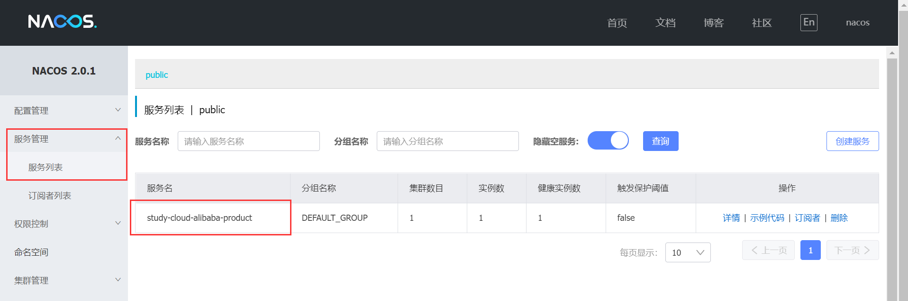
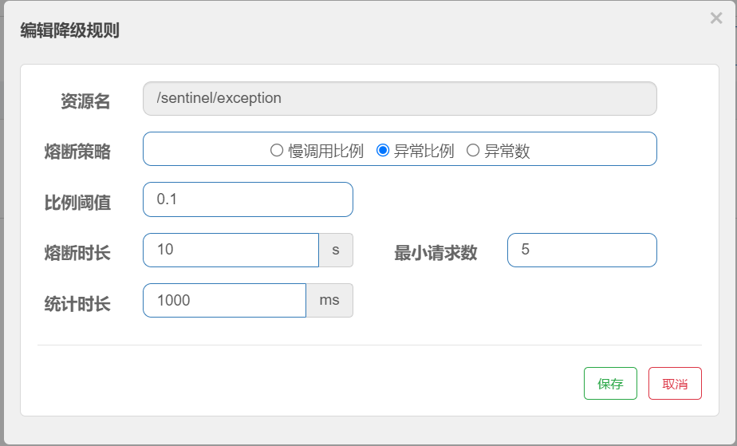

# spring cloud alibaba

## 一、注册中心（discovery）

1. 启动nacos

   进入bin目录下，cmd进入命令行，输入 startup.cmd -m standalone 回车，启动nacos
   
2. 配置文件中，添加nacos配置

   ```yaml
   spring:
     application:
       #应用名称
       name: study-cloud-alibaba-product
     cloud:
       nacos:
         discovery:
           #nacos 注册中心地址
           server-addr: http://localhost:8848
           #注册到哪个命名空间中(不填,默认为public)
           namespace: 3e81c560-3c91-484f-bb67-c1a4e01ce688
           #不注册到注册中心(默认注册)
           register-enabled: true
   ```

3. 在启动类中，添加注解@EnableDiscoveryClient，开启服务注册与发现功能

   ```java
   @SpringBootApplication
   //开启服务注册与发现功能
   @EnableDiscoveryClient
   public class StudyCloudAlibabaProductApplication {
   
       public static void main(String[] args) {
           SpringApplication.run(StudyCloudAlibabaProductApplication.class, args);
       }
   
   }
   ```

4. 启动后，在nacos服务管理-服务列表可看到已注册服务



## 二、配置中心（config）

1. 在resources下创建bootstrap.properties或bootstrap.yml。config是默认从bootstrap中读取config配置

2. 在配置文件中配置config配置信息

   ```yaml
   cloud:
         config:
           #nacos 配置中心地址
           server-addr: http://localhost:8848
           #是否开启监听和自动刷新
           refresh-enabled: true
           #告诉从哪个命名空间获取配置(不填,默认为public)
           namespace: f15dc566-c615-4dbe-88f9-0c812ea6e2f6
           #配置文件名称(Data Id)
           #name: ${spring.application.name}
           #文件后缀是什么类型
           file-extension: yml
           #从哪个组进行配置获取（Group）
           group: DEFAULT_GROUP
           #多文件配置
           extension-configs[0]:
             dataId: ${spring.application.name}.yml
             group: DEFAULT_GROUP
             #true时(默认flase),@RefreshScope才能生效
             refresh: true
           extension-configs[1]:
             dataId: all.yml
             group: DEFAULT_GROUP
             refresh: true
   ```
   
   - 配置单文件在name中配置就即可，多文件在extension-configs中配置。
   
   - @RestController，更改配置文件，程序不用重启，就可以读取更新后的配合数据
   
     ```java
     //更改配置文件，程序不用重启，就可以读取更新后的配置数据
     @RefreshScope
     @RestController
     public class TestConfigController {
     
         @Value("${test.alibaba.config}")
         public String configName;
     
         @Value("${test.all}")
         public String all;
     
         @RequestMapping("/testAlibabaConfig")
         public Object testAlibabaConfig(){
             return Arrays.asList(configName,all);
         }
     }
     ```
   
   - extension-configs:refresh=true时（默认flase），@RestController才能生效

## 三、远程调用（dubbo）

1. 在配置文件中配置dubbo配置信息

```
dubbo:
  application:
    #dubbo应用名称
    name: ${spring.application.name}
    #是否使用远程的元数据中心，如果使用，则会将元数据信息注册到指定的元数据中心，否则使用本地元数据中心
    metadata-type: local
    #qos=Quality of Service 是Dubbo的在线运维命令，可以对服务进行动态的配置、控制(上下线)及查询，
    #qos-enable: true
  registry:
    # 注册中心与注册地址
    address: spring-cloud://127.0.0.1:8848
    #不将注册中心用于配置中心
    use-as-config-center: false
    #是否允许注册
    register: true
    #是否允许订阅
    #subscribe: true
    # 注册者允许的协议
    #accepts: dubbo,rest
  #consumer:
    #启动时不检查生产者的状态，防止生产者未启动时启动失败
    #check: false
  #provider:
    # 服务提供者要求使用随机Token加密，防止消费者绕过注册中心调用
    #token: true
  #Dubbo服务暴露的协议配置
  protocol:
    #协议名称
    name: dubbo
    # dubbo协议端口(1 表示自增端口,从20880开始)
    port: -1
  #dubbo服务扫描基准包
  scan:
    #base-packages: com.lincheng.study.api
  cloud:
    #Dubbo 消费端订阅服务端的应用名，多个服务提供者用逗号分隔
    subscribed-services: study-cloud-alibaba-product
```

- metadata-type
  - dubbo.application.metadata-type 的取值为 remote 或 local， 默认 local。对于 应用的元数据，Dubbo提供了两种保存方式 【本地保存】 和 【元数据中心保存】。如果为local ，则会将应用的元数据信息保存在应用本地，否则则会将元数据信息保存到 metadata-report.address 指定的元数据中心中。因此，当此属性为 remote 时， 必须存在 metadata-report.address 配置
  - 调用时机：在DubboBootstrap中会调用 DubboBootstrap#initialize会调用 DubboBootstrap#initMetadataService方法，其中会根据 metadata-type 类型来获取不同的 MetadataService 实现类从而实现本地或远程保存
2. 提供者暴露接口

   ```java
   //暴露接口
   @DubboService
   public class ProductServiceApiImpl implements IProductServiceApi {
   
       public Object testDubbo(String source){
           return source + "测试product,dubbo成功";
       }
   }
   ```

3. 消费者调用提供者

   ```java
   @RestController
   @RequestMapping("/testDubbo")
   public class TestDubboController {
   
       @DubboReference(check = false, timeout = 5 * 1000, retries = 0)
       private IProductServiceApi productServiceApi;
   
       @RequestMapping("/transferProduct")
       public Object transferProduct() {
           return productServiceApi.testDubbo("consumer");
       }
   
   }
   ```


## 四、消息队列（rocketMQ）

1. github地址：

   [RocketMQ配合说明](https://github.com/alibaba/spring-cloud-alibaba/wiki/RocketMQ) 

   [rocketmq-example](https://github.com/alibaba/spring-cloud-alibaba/blob/master/spring-cloud-alibaba-examples/rocketmq-example/readme-zh.md) 

2. Spring Cloud Stream 内部有两个概念：Binder 和 Binding。

   - Binder: 跟外部消息中间件集成的组件，用来创建 Binding，各消息中间件都有自己的 Binder 实现。

3. rocket [win10配置，启动](https://blog.csdn.net/bbc2005/article/details/85218497?ops_request_misc=%257B%2522request%255Fid%2522%253A%2522161830122416780271530766%2522%252C%2522scm%2522%253A%252220140713.130102334.pc%255Fall.%2522%257D&request_id=161830122416780271530766&biz_id=0&utm_medium=distribute.pc_search_result.none-task-blog-2~all~first_rank_v2~rank_v29-1-85218497.first_rank_v2_pc_rank_v29&utm_term=rockermq++win10%E6%9C%AC%E5%9C%B0%E5%AE%89%E8%A3%85) 

   - 启动NameServer

     ```
     start mqnamesrv.cmd
     ```

   - 启动Broker

     ```
     start mqbroker.cmd -n 127.0.0.1:9876 autoCreateTopicEnable=true
     ```

   - 关闭broker

     ```
     mqshutdown.cmd broker
     ```

   - 关闭namesrv

     ```
     mqshutdown.cmd namesrv
     ```

4. 配置 Input 和 Output 的 Binding 信息并配合 `@EnableBinding` 注解使其生效

   ```java
   @EnableBinding({ProductStream.class})
   public class StudyCloudAlibabaProductApplication {
   
       public static void main(String[] args) {
           SpringApplication.run(StudyCloudAlibabaProductApplication.class, args);
       }
   }
   ```

5. 生产者yml配置

   ```yaml
   spring:
     cloud:
     	stream:
         bindings:
           output: {destination: study-rocketMQ-topic, content-type: application/json}
         rocketmq:
           binder:
             name-server: localhost:9876
           bindings:
             output:
               producer:
                 #是否启用 Producer,默认值: true
                 enable: true
                 #是否使用同步得方式发送消息。默认值: false
                 sync: false
   
   ```

6. input通道接口

   ```java
   public interface ProductStream {
   
       @Output("output")
       MessageChannel productOutput();
   
   }
   ```

7. 消费者yml配置

   ```yaml
   spring:
     cloud:
     	stream:
         bindings:
           output: {destination: study-rocketMQ-topic, content-type: application/json, group: product-output-group }
         rocketmq:
           binder:
             name-server: localhost:9876
           bindings:
             output:
               consumer:
                 enabled: true
                 #Consumer 是否是广播消费模式。如果想让所有的订阅者都能接收到消息，可以使用广播模式。默认值: false。
                 broadcasting: false
                 #Consumer 是否同步消费消息模式。
                 orderly: false
   
   ```

8. input通道接口

   ```java
   public interface ConsumerStream {
   
       @Input("output")
       SubscribableChannel consumerOutput();
   
   }
   ```

9. 消费者监听

   ```JAVA
   @Component
   public class ConsumerStreamListener {
       @StreamListener("output")
       public void onMessage(@Payload RocketMQMessageDTO message) {
           System.out.println("消费mq");
           System.out.println("线程编号:" + Thread.currentThread().getId());
           System.out.println("消息内容:" + message);
       }
   
   }
   ```

10. 总结

    - 无论是yml，还是代码绑定的通道，都是要同一个才能进行发送与接

## 五、事务管理（seata）

1. seata server (TC) 环境搭建

   - Server端存储模式(store.mode) 支持三种:

     - file: (默认)单机模式，全局事务会话信息内存中读写并持久化本地文件root.data,性能较高(默认)

     - db:高可用模式，全局事务会话信息通过db共享,相应性能差些

       - 配置file.conf，目录路径：seata-server-1.3.0\seata\conf\file.conf

         ```
         store {
         
           mode = "db"
         
           db {
             datasource = "druid"
             dbType = "mysql"
             driverClassName = "com.mysql.cj.jdbc.Driver"
             url = "jdbc:mysql://127.0.0.1:3306/seata"
             user = "root"
             password = "123456"
             minConn = 5
             maxConn = 30
             globalTable = "global_table"
             branchTable = "branch_table"
             lockTable = "lock_table"
             queryLimit = 100
             maxWait = 5000
           }
         
         }
         ```
   
       - mysql8.0及以上版本的需要更改:`driverClassName = "com.mysql.cj.jdbc.Driver"`
   
       - 创建数据库，名称为：seata
   
       - 创建表，sql在资源文件中：目录路径：seata-1.3.0\seata-1.3.0\script\server\db

       - 在每个库中加上undo_log表：资源文件在：seata-1.3.0\script\client\at\db 中。

     - redis: Seata-Server 1.3及以上版本支持，性能较高，存在事务信息丢失风险请提前配置适合当前场景的redis持久化配置

   - 配置注册中心与配置中心

     - 配置registry.conf：路径：seata-server-1.3.0\seata\conf\registry.conf
   
       ```
       registry {
       
         type = "nacos"
       
         nacos {
           application = "seata-server"
           serverAddr = "127.0.0.1:8848"
           group = "SEATA_GROUP"
           namespace = ""
           cluster = "default"
           username = "nacos"
           password = "nacos"
         }
       
       }
       
       config {
       
         type = "nacos"
       
         nacos {
           serverAddr = "127.0.0.1:8848"
           namespace = "9e91ae12-78e0-4354-b271-dd5787d790e9"
           group = "SEATA_GROUP"
           username = "nacos"
           password = "nacos"
         }
       
       }
       ```

     - 将seata配置信息，配置到nacos中, 资源文件中：目录路径：\seata-1.3.0\seata-1.3.0\script\config-center\config.txt，并且修改配置内容。
   
       - 将store.mode=file 改成store.mode=db，删除不必要的file，redis配置
       - service.vgroupMapping.my_test_tx_group=default  事务分组，解决异地环境问题，可以自定义，对应的client也要去设置；default  必须等于registry.conf中的registry.nocos.cluster = "default"
       
  - 启动nacos-config.sh，把配置好的配置信息，加载到nacos配置中心；路径：seata-1.3.0\seata-1.3.0\script\config-center\nacos
   
  - 执行 sh nacos-config.sh -h 127.0.0.1 -p 8848 -g STATA_GROPU -t 9e91ae12-78e0-4354-b271-dd5787d790e9或者直接双击执行nacos-config.sh
   
    -h: host,默认值localhost
       -p: port,默认值8848
       -g:配置分组,默认值为'SEATA_ GROUP'
       -t:租户信息，对应Nacos的命名空间ID字段,默认值为空
   
  - 总结：需要config.txt的数据源改为db.然后通过nacos-config.sh注册到配置中心
   
- 启动seata
  
  - 执行seata-server-1.3.0\seata\bin\seata-server.bat
  
2. 项目配置
   
   1. 添加依赖
   
      ```
      		<dependency>
                  <groupId>com.alibaba.cloud</groupId>
                  <artifactId>spring-cloud-starter-alibaba-seata</artifactId>
              </dependency>
      ```
   
   2.   各微服务对应数据库中添加undo_log表，sql路径：seata-1.3.0\script\client\at\db
   
   3. 配合yml
   
      ```yaml
      spring:
        cloud:
          alibaba:
            seata:
              #配置事务分组，service.vgroupMapping.my_test_tx_group=default。要保持一致性。
              tx-service-group: my_test_tx_group
              
      #seata配置
      seata:
        #注册中心
        registry:
          #配置seata的注册中心
          type: nacos
          nacos:
            #服务地址
            server-addr: http://localhost:8848
            #服务名称
            application: seata-server
            #分组名称
            group: SEATA_GROUP
            #用户
            username: nacos
            #密码
            password: nacos
        #配置seata配置中心，可以读取关于seata clinet的配置
        config:
          type: nacos
          nacos:
            #服务地址
            server-addr: http://localhost:8848
            #用户
            username: nacos
            #密码
            password: nacos
            #分组
            group: SEATA_GROUP
            #命名空间
            #namespace: b34fc235-df78-430b-945d-e46a5efa0ae8
      ```
   
   5. 消费者业务代码，只需要在方法上加@GlobalTransactional注解即可
   
      ```java
      @Service
      public class SeataOrderServiceImpl extends ServiceImpl<SeataOrderMapper, SeataOrder> implements ISeataOrderService {
      
          @Resource
          private SeataOrderMapper seataOrderMapper;
      
          @DubboReference(check = false, timeout = 5 * 1000, retries = 0)
          private IProductServiceApi productServiceApi;
      
      
          @Override
          @GlobalTransactional
          public void saveSeataOrder(){
              SeataOrder seataOrder = new SeataOrder();
              seataOrder.setOrderNum(1);
              seataOrder.setProductId(1L);
              seataOrderMapper.insert(seataOrder);
      
              productServiceApi.testSeata(1L);
          }
      
      }
      ```
   
   6. 生产者业务代码
   
      ```java
      @Service
      public class SeataProductServiceImpl extends ServiceImpl<SeataProductMapper, SeataProduct> implements ISeataProductService {
      
          @Resource
          private SeataProductMapper seataProductMapper;
      
      
          @Override
          public void testSeata(Long productId) {
      
              SeataProduct seataProduct = seataProductMapper.selectById(productId);
              seataProduct.setStockNum(seataProduct.getStockNum() - 1);
      
              Integer a = 1/0;
      
              seataProductMapper.updateById(seataProduct);
      
          }
      
      }
      ```
   

## 六、流控（sentinel）

1. 部署sentinel控制台

   - [jar下载](https://github.com/alibaba/Sentinel/releases) 

   - [jar启动](https://github.com/alibaba/Sentinel/wiki/%E6%8E%A7%E5%88%B6%E5%8F%B0) 

     ```
     java -Dserver.port=8858  -jar sentinel-dashboard-1.8.1.jar
     ```

2. 整合

   - 添加依赖

     ```xml
     <dependency>
         <groupId>com.alibaba.cloud</groupId>
         <artifactId>spring-cloud-starter-alibaba-sentinel</artifactId>
         <version>${spring.cloud.alibaba.version}</version>
     </dependency>
     ```

   - yml配置

     ```yaml
     spring:
       cloud:
         sentinel: 
           transport:
             #绑定sentinel服务
           	dashboard: http://localhost:8858
           #默认将调用链路收敛
           web-context-unify: false	
     ```

3. 持久化配置

   - 加入依赖

     ```xml
      <dependency>
      	<groupId>com.alibaba.csp</groupId>
         <artifactId>sentinel-datasource-nacos</artifactId>
      </dependency>
     ```

   - [配置说明](https://github.com/alibaba/Sentinel/wiki/%E5%A6%82%E4%BD%95%E4%BD%BF%E7%94%A8) 

     

   - yml添加配置

     ```yaml
     spring:
       cloud:
         sentinel: 
           datasource:
             #自定义
             sentinel-app:
               nacos:
                 server-addr: http://localhost:8848
                 username: nacos
                 password: nacos
                 dataId: sentinel-application
                 #groupId: SENTINEL_GROUP
                 #namespace: 3e81c560-3c91-484f-bb67-c1a4e01ce688
                 #data-type: json
                 rule-type: flow
     ```

4. 控制台配置

   1. 流控规则

      1. 流控模式

         - 阈值类型

           - QPS：每秒最大请求数
           - 线程数：每秒最大并发数

         - 流控模式

           - 直接：

             针对当前资源进行处理

           - 关联：

             A资源关联B资源，请求发给B，如果达到阈值，那么则对A限流。

             如/add接口大量请求，对/select接口进行限流（对select进行配置）（某时刻，大量插入数据，这时限流查询）

             

           - 链路：

             接口/testLinkOne 调用 testLinkService()方法，接口/testLinkTow调用 testLinkService()方法。在方法testLinkService()中添加@SentinelResource。对/testLinkTow配置。只有testLinkTow达到阈值才会进行限流，而/testLinkOne不会有影响。（这个有点鸡肋，可以配置成直接，流控testLinkTow是一样的效果）

             ```
             	@SentinelResource(blockHandler = "flowblockHandler")
                 public String testLinkService(String api){
                     return "testLink:" + api;
                 }
             
             	public String flowblockHandler(String api,BlockException ex) {
                     return "链路流控！！！！！！! ! " ;
                 }
             ```

      2. 流控效果

         - 快速失败（默认使用）：

           超出阈值规则后直接抛出异常

         - warm up（预热）:

           主要用来流控洪峰流量，冷启动（RuleConstant.CONTROL_BEHAVIOR_WARM_UP）方式。该方式主要用于系统长期处于低水位的情况下，当流量突然增加时，直接把系统拉升到高水位可能瞬间把系统压垮。通过"冷启动"，让通过的流量缓慢增加，在一定时间内逐渐增加到阈值上限，给冷系统一个预热的时间，避免冷系统被压垮的情况。比如设置的阈值为9，预热时间5s，冷加载因子是3,那最初的阈值时9/3 = 3,逐步加大阈值，5s后达到9。

           

         - 排队等待

           主要用来流控脉冲流量，需要设置将阈值模式设置为QPS才能生效。这种方式严格控制了请求通过的间隔时间，也即是让请求以均匀的速度通过，对应的是漏桶算法。每秒能处理5个QBS，如果一秒有10个QSB，将通5个QSB，还有5个QSB,将等待5秒中再处理，如果5秒后处理不了，将不处理。
      
   2. 熔断降级规则

      - 慢调用比例

        慢调用比例(SLOW_ REQUEST RATIO):选择以慢调用比例作为阈值，需要设置允许的慢调用RT (即最大的响应时间)， 请求的响应时间大于该值则统计为慢调用。统计时长内请求数目大于设置的最小请求数目，并且慢调用的比例大于比例阈值，则接下来的熔断时长内请求会自动被熔断。经过熔断时长后熔断器会进入探测恢复状态(HALF-OPEN 状态) ,若接下来的一个请
        求响应时间小于设置的慢调用RT则结束熔断，若大于设置的慢调用RT则会再次被熔断。

        

      - 异常比例

        异常比例(RROR RATIO): 当单位统计时长(statIntervaMs) 内请求数目大于设置的最小请求数目,并且异常的比例大于阈值,则接下来的熔断时长内请求会自动被熔断。经过熔断时长后熔断器会进入探测恢复状态(HALF-OPEN状态)，若接下来的一个请求成功完成(没有错误)则结束熔断，否则会再次被熔断。异常比率的阈值范围是[0.0, 1.0], 代表0% - 100%。

        

      - 异常数

        异常数(RROR CouNT):当单位统计时长内的异常数目超过阈值之后会自动进行熔断。经过熔断时长后熔断器会进入探测恢复状态(HALF_OPEN状态)，若接下来的一个请求成功完成(没有错吴)则结束熔断,否则会再次被熔断。注意:异常降级仅针对业务异常,对Sentinel限流降级本身的异常(BlockException) 不生效。

        
      
   3. 热点规则

      配置热点参数规则注意:资源名必须是@SentinelResource(value="资源名")中 配置的资源名，热点规则依赖于注解如图中：当id=1或者id=2时 QPS为1时就限流，当id为别的参数时以上面的单机阈值配置为准

      

      ```java
      @RequestMapping("/hotSpot/{id}")
      @SentinelResource(value = "hotSpot",blockHandler = "hotBlockHandler")
      public String hotSpot(@PathVariable("id") String id){
           return id;
      }
          
      public String hotBlockHandler(@PathVariable("id") String id,BlockException ex) {
              return "热点流控! ! ";
      }
      ```
      
   4. 系统规则

      - Load自适应(仅对Linux/Unix-like 机器生效) :系统的load1作为启发指标，进行自适应系统保护。当系统load1超过设定的启发值，且系统当前的并发线程数超过估算的系统容量时才会
        触发系统保护(BBR 阶段)。系统容量由系统的maxQps * minRt估算得出。设定参考值一般是CPU cores * 2.5
      - CPU usage (1.5.0+ 版本) :当系统CPU使用率超过阈值即触发系统保护(取值范围0.0-1.0)，比较灵敏。
      - 平均RT:当单台机器上所有入口流量的平均RT达到阈值即触发系统保护，单位是毫秒。
      - 并发线程数:当单台机器上所有入口流量的并发线程数达到阈值即触发系统保护。
      - 入口QPS:当单台机器上所有入口流量的QPS达到阈值即触发系统保护。

5. gateway整合sentinel 

   [整合-官方文档](https://github.com/alibaba/Sentinel/wiki/%E4%B8%BB%E6%B5%81%E6%A1%86%E6%9E%B6%E7%9A%84%E9%80%82%E9%85%8D#spring-cloud-gateway) 

6. dubbo整合sentinel 

   [整合-官方文档](https://github.com/alibaba/Sentinel/wiki/%E4%B8%BB%E6%B5%81%E6%A1%86%E6%9E%B6%E7%9A%84%E9%80%82%E9%85%8D#dubbo) 

## 七、网关（gateway）

1. 整合

   - 添加依赖

     ```xml
     		<dependency>
                 <groupId>org.springframework.cloud</groupId>
                 <artifactId>spring-cloud-starter-gateway</artifactId>
             </dependency>
     ```

   - yml配置

     ```yaml
     spring:
       #注册服务
       cloud:
         nacos:
           discovery:
             server-addr: http://localhost:8848
             register-enabled: true
         #gateway配置
         gateway:
           #是否启动自动识别 nacos服务
           #discovery:
             #locator:
               #enabled: true
           #路由规则
           routes:
               # 路由的唯一标识
             - id: study-cloud-alibaba-product
               # 需要转发的地址
               # lb:使用nacos中的本地负载均衡策略
               uri: lb://study-cloud-alibaba-product
               # 断言规则（用于路由规则的匹配）
               predicates:
                 - Path=/study-cloud-alibaba-product/**
               filters:
                 #转发前去除第一层路径
                 - StripPrefix=1
     
     ```

2. Predicate（断言规则）

   - 通过时间匹配

     - After:当前时间在设置的时间之后，才会转发，在这之前不进行转发
     - Before:当前时间在设置的时间之前，才会转发，在这之前不进行转发
     - Between:当前时间在设置的时间之间，才会转发，在这之前不进行转发

     ```yaml
     spring:
       cloud:
         #gateway配置
         gateway:
           #路由规则
           routes:
             - id: study-cloud-alibaba-product
               uri: lb://study-cloud-alibaba-product
               predicates:
                 # 当前时间在设置的时间之后，才会转发，在这之前不进行转发
                 - After=2021-01-20T06:06:06+08:00[Asia/Shanghai]
                 # 当前时间在设置的时间之前，才会转发，在这之前不进行转发
                 - Before=2022-01-20T06:06:06+08:00[Asia/Shanghai]
                 #  当前时间在设置的时间之间，才会转发，在这之前不进行转发
                 - Between=2018-01-20T06:06:06+08:00[Asia/Shanghai],2023-01-20T06:06:06+08:00[Asia/Shanghai]
              
     ```

   - 通过 Cookie 匹配

     Cookie Route Predicate 可以接收两个参数，一个是 Cookie name , 一个是正则表达式，路由规则会通过获取对应的 Cookie name 值和正则表达式去匹配，如果匹配上就会执行路由，如果没有匹配上则不执行。

     ```yaml
     spring:
       cloud:
         gateway:
           routes:
            - id: cookie_route
              uri: http://ityouknow.com
              predicates:
              - Cookie=ityouknow, kee.e
     ```

   - Host Route Predicate 接收一组参数，一组匹配的域名列表，这个模板是一个 ant 分隔的模板，用`.`号作为分隔符。它通过参数中的主机地址作为匹配规则。

     ```yaml
     spring:
       cloud:
         gateway:
           routes:
           - id: host_route
             uri: http://ityouknow.com
             predicates:
             - Host=**.ityouknow.com
     ```

   - 通过请求方式匹配

     可以通过是 POST、GET、PUT、DELETE 等不同的请求方式来进行路由。

     ```yaml
     spring:
       cloud:
         gateway:
           routes:
           - id: method_route
             uri: http://ityouknow.com
             predicates:
             - Method=GET,POST
     ```

   - 通过请求路径匹配

     Path Route Predicate 接收一个匹配路径的参数来判断是否走路由；如果请求路径符合要求，则此路由将匹配，例如：/foo/1 或者 /foo/bar。

     ```yaml
     spring:
       cloud:
         gateway:
           routes:
           - id: host_route
             uri: http://ityouknow.com
             predicates:
             - Path=/foo/{segment}
     ```

   - 通过请求参数匹配

     Query Route Predicate 支持传入两个参数，一个是属性名一个为属性值，属性值可以是正则表达式。

     ```yaml
     spring:
       cloud:
         gateway:
           routes:
           - id: query_route
             uri: http://ityouknow.com
             predicates:
             - Query=smile
     ```

   - 通过请求 ip 地址进行匹配

     Predicate 也支持通过设置某个 ip 区间号段的请求才会路由，RemoteAddr Route Predicate 接受 cidr 符号 (IPv4 或 IPv6) 字符串的列表(最小大小为 1)，例如 192.168.0.1/16 (其中 192.168.0.1 是 IP 地址，16 是子网掩码)。

     ```yaml
     spring:
       cloud:
         gateway:
           routes:
           - id: remoteaddr_route
             uri: http://ityouknow.com
             predicates:
             - RemoteAddr=192.168.1.1/24
     ```

3. filters（过滤器） 

   - AddRequestHeader 过滤器
   - AddRequestParameter 添加参数过滤器
   -  Addresponseheader 过滤器
   -  DedupeResponseHeader 去重响应过滤器
   - 默认过滤器

4. 整合sentinel

   - 添加依赖

     ```xml
             <!--流控sentinel-->
             <dependency>
                 <groupId>com.alibaba.cloud</groupId>
                 <artifactId>spring-cloud-starter-alibaba-sentinel</artifactId>
             </dependency>
     
             <!--sentinel整合gateway-->
             <dependency>
                 <groupId>com.alibaba.cloud</groupId>
                 <artifactId>spring-cloud-alibaba-sentinel-gateway</artifactId>
             </dependency>
     ```

   - 添加sentinel配置

     ```yaml
     spring:
       cloud:
         sentinel:
           transport:
             dashboard: http://localhost:8858
     ```

   - 网关流控

     api类型：有现种，一种配置中的routes:id，一种为自定义的api分组

     匹配模式：精确（完全匹配），字串（存在，类似于like）,正则（匹配正则表达式）

     Burst size：可以不控制的次数。

     别的配置与服务流控是一样的。

     

   - api管理

     可以自定义请求接口。对请求接口进行分类配置，在网关流控中的API 类型，选择API 分组 ，可做出不同的流控规则。

     

   - 降级规则，系统规则与服务流控是一样的。

5. gateway全局异常处理

   两种配置方法

   - config

     ```java
     package com.lincheng.study.config;
     
     import com.alibaba.csp.sentinel.adapter.gateway.sc.callback.BlockRequestHandler;
     import com.alibaba.csp.sentinel.adapter.gateway.sc.callback.GatewayCallbackManager;
     import com.alibaba.csp.sentinel.slots.block.authority.AuthorityException;
     import com.alibaba.csp.sentinel.slots.block.degrade.DegradeException;
     import com.alibaba.csp.sentinel.slots.block.flow.FlowException;
     import com.alibaba.csp.sentinel.slots.block.flow.param.ParamFlowException;
     import com.alibaba.csp.sentinel.slots.system.SystemBlockException;
     import org.springframework.context.annotation.Configuration;
     import org.springframework.http.HttpStatus;
     import org.springframework.http.MediaType;
     import org.springframework.web.reactive.function.BodyInserters;
     import org.springframework.web.reactive.function.server.ServerResponse;
     import org.springframework.web.server.ServerWebExchange;
     import reactor.core.publisher.Mono;
     
     import javax.annotation.PostConstruct;
     import java.util.HashMap;
     
     /**
      * @description:
      * @author: linCheng
      * @create: 2022-01-06 15:58
      **/
     @Configuration
     public class GatewayConfig {
     
         @PostConstruct
         public void init(){
             BlockRequestHandler blockRequestHandler = new BlockRequestHandler() {
                 @Override
                 public Mono<ServerResponse> handleRequest(ServerWebExchange serverWebExchange, Throwable throwable) {
     
                     HashMap<Object, Object> result = new HashMap<>();
     
                     if (throwable instanceof FlowException) {
                         result.put("resultCode","901");
                         result.put("resultMsg","接口限流了gateway");
                     } else if (throwable instanceof DegradeException) {
                         result.put("resultCode","902");
                         result.put("resultMsg","服务降级了gateway");
                     } else if (throwable instanceof ParamFlowException) {
                         result.put("resultCode","903");
                         result.put("resultMsg","热点参数限流了gateway");
                     } else if (throwable instanceof SystemBlockException) {
                         result.put("resultCode","904");
                         result.put("resultMsg","触发系统保护规则了gateway");
                     } else if (throwable instanceof AuthorityException) {
                         result.put("resultCode","905");
                         result.put("resultMsg","授权规则不通过gateway");
                     }
     
                     // 自定义异常处理
                     return ServerResponse.status(HttpStatus.OK)
                             .contentType(MediaType.APPLICATION_JSON)
                             .body(BodyInserters.fromValue(result));
     
                 }
             };
     
             GatewayCallbackManager.setBlockHandler(blockRequestHandler);
         }
     }
     
     ```

   - yml

     ```yaml
     spring:
       cloud:
         sentinel:
           scg:
             fallback:
               mode: response
               response-body: "{'resultCode':'901','resultMsg':'接口限流了gateway-yml'}
     ```

## 八、链路追踪（zipkin）

1. 添加依赖

   ```xml
           <dependency>
               <groupId>org.springframework.cloud</groupId>
               <artifactId>spring-cloud-starter-zipkin</artifactId>
           </dependency>
   ```

2. 添加配置

   ```yaml
   spring:
     zipkin:
       #zipkin服务地址
       base-url: http://124.223.106.150:9411/
       #关闭服务发现，否则spring cloud 会把zipkin的url当做服务名称
       sender:
         #设置http的方式传输数据
         type: web
     sleuth:
       sampler:
         #设置抽样采集率为100%; 默认为0.1,即10%
         probability: 1
   ```

3. 整合dubbo

   [整合-官方文档](https://docs.spring.io/spring-cloud-sleuth/docs/current/reference/html/integrations.html#sleuth-rpc-dubbo-integration) 

   - 添加依赖

     ```xml
     		<dependency>
                 <groupId>io.zipkin.brave</groupId>
                 <artifactId>brave-instrumentation-dubbo</artifactId>
             </dependency>
     ```

   - dubbo.properties添加过滤器

     ```yaml
     dubbo:
       consumer:
         #过滤为追踪
         filter: 'tracing'
       provider:
         #过滤为追踪
         filter: 'tracing'  
     ```

